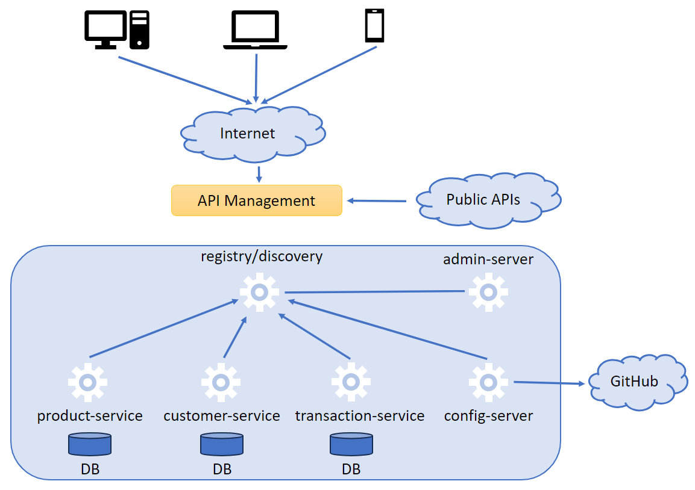

# Payment Chain Project

This project is a solution for a startup of the financial sector.
This startup requires a technological solution to support their business core to handle and
management their customer information, products, transactions, communication with partners and
other operating processes we have to provide a solution based in microservices architecture.

For the solution we will focus on the customers, products, and transactions of the company based in a microservices based architecture. We will create two modules inside the parent to separete the business domain services of the infrastructure domain services.

## Domain-Driven Design (DDD)

Domain-driven design (DDD) is a major software design approach, focusing on modeling software to match a domain according to input from that domain's experts.

## Architecture Design Proposal



For this solution we need to configure a couple of services like registry/discovery, administration of the business services, and a configuration service that retrives the configuration for each business service from a GitHub repository.

## Technologies

- Java
- Spring Boot
- Spring Cloud
- Maven
- Docker
- Git

## Project structure

```
payment-chain-parent/
├── business-domain/
    ├── product-service/
    ├── customer-service/
    ├── transaction-service/
├── infrastructure-domain/
    ├── eureka-server/
    ├── config-server/
    ├── admin-server/
    ├── gateway-service/
```
